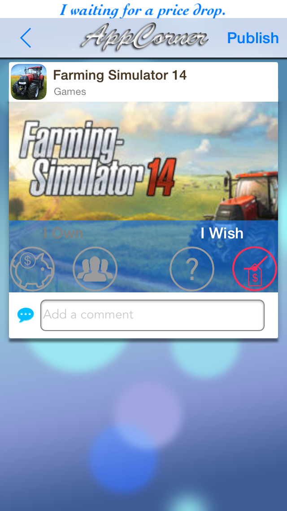

AppCorner
============

Share your favorites apps on AppCorner and discover new apps around the world with your friends.

This app for iOS (iPhone only) use [Deployd](http://deployd.com) as server on [appcorner.it](http://www.appcorner.it) and  [DeploydKit](https://github.com/appcornerit/DeploydKit) library.

**Build your server is quite simple**, refer to [README](https://github.com/appcornerit/AppCorner-Social/tree/master/Deployd-Modules) to try the app with your server (on localhost or aws or with loopback as backend instead of deployd).

**You can use AppCorner on appcorner.it to share your apps with others developers, your apps will soon posted on appcorner.it (work in progress).**

I encourage anyone who wants to contribute and update the project.
You can build your social app that share musics, books or TV series (from iTunes) with few changes.

The story:
- I developed [DeploydKit](https://github.com/appcornerit/DeploydKit)
- I saw [Anypic](https://github.com/ParsePlatform/Anypic) a full featured photo sharing app built by [Parse.com](https://parse.com)
- I developed a layer called [ParseKit] (https://github.com/appcornerit/AppCorner-Social/tree/master/External/ParseKit) to replace Parse framework on top of DeploydKit
- I developed the code of the server quickly
- Anypic works with Deployd!
- I moved the photo entity as app entity (and other customizations) and so the new name is AppCorner
- AppCorner works with Deployd!
- The app not pass the [approval rule](https://developer.apple.com/app-store/review/guidelines/) 2.25 of App Store
- I forgot the app for some time
- I developed AppCornerKit and [iTunesPicker](https://github.com/appcornerit/iTunesPicker) as new project starting from pieces of AppCorner
- Now the app is open source

**Author**: Denis Berton [@DenisBerton](https://twitter.com/DenisBerton)

 
 

